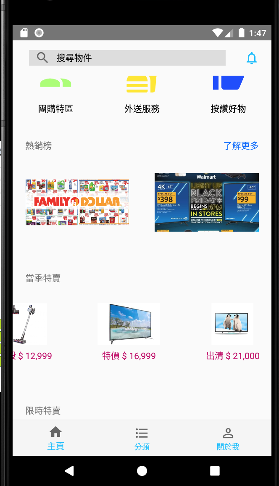
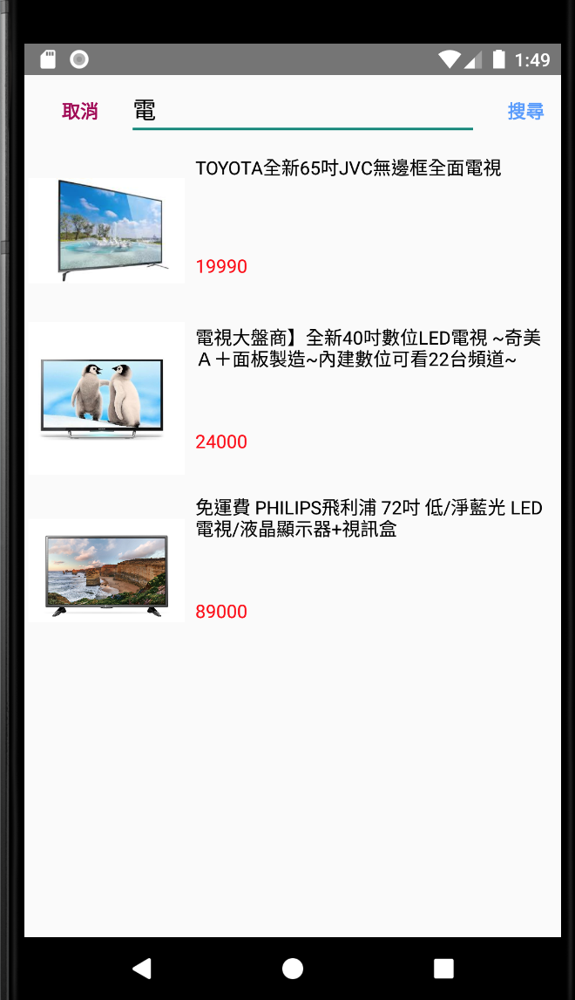
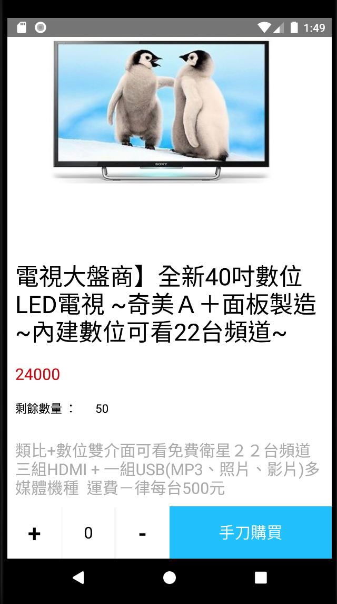

# shopping-server
這是一個模擬購物商城的 Android-client 端，
配合 [shopping-server版本](https://github.com/webronin26/shopping-server) 的 server 端來使用

## 目前的功能

| API  |
| ------------- |
| (GET) /main |
- 回傳首頁的圖片url / 影片 / 首頁宣傳資訊 

| API  |
| ------------- |
| (GET) /search?q=keywords |
- 回傳夾有關鍵字名稱的產品 

| API  |
| ------------- |
| (GET) /query/product/{product_id} |
- 回傳某產品詳細資訊

| API  |
| ------------- |
| (GET) /query/product/{product_id} |
- 回傳某產品詳細資訊

| API  |
| ------------- |
|(POST) /login|
| (Request body) email : 使用者email / password : 使用者密碼|
- 使用email和密碼登入會員，驗證成功之後回傳 token 值

| API  |
| ------------- |
|(POST) /member/buy|
|(Header) Authorization : 使用者的token|
|(Request body) product_id : 產品的id / number : 要購買的數量|
- 購買產品

| API  |
| ------------- |
|(DELETE) /member/logout |
|(Header) Authorization : 使用者的 token|
- 登出

## 目前的使用畫面

首頁：

搜尋產品頁面：

購買產品頁面：

